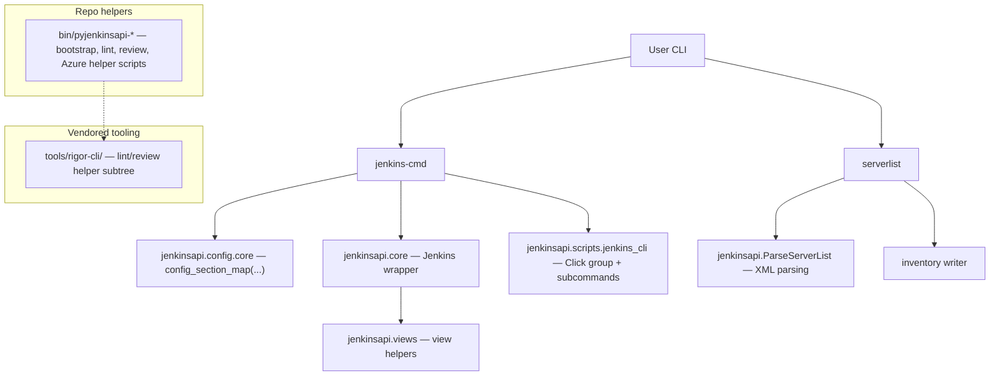

# pyjenkinsapi

Lightweight Python wrapper around Jenkins that exposes a small CLI for listing views/jobs and exporting job configuration. Jenkins credentials and server URL are intended to come from `jenkins.ini`, with CLI overrides available when needed.

The repository also vendors `tools/rigor-cli/` for local lint/review workflows and includes `bin/` helpers for repo maintenance and Azure automation experiments.

---

## Quick Start: Jenkins CLI Journey

### 1. Install dependencies

```bash
python3 -m pip install -r requirements.txt
python3 -m pip install -e .
```

### 2. Configure Jenkins connection values

Create or update `jenkins.ini` with the credentials and URL you want the CLI to use:

```ini
[lcjenkins]
url = https://jenkins.example.com
user = your-username
password = your-password
```

You can also override these values directly on the command line with `--jenkins-server-url`, `--jenkins-user`, and `--jenkins-password`.

### 3. Inspect Jenkins views and jobs

```bash
jenkins-cmd --help
jenkins-cmd views --all
jenkins-cmd views my-view
serverlist
```

### 4. Verify local tooling

```bash
bash -n bin/pyjenkinsapi-review
shellcheck -S warning bin/pyjenkinsapi-review
bats scripts/tests/pyjenkinsapi-review.bats
```

---

## Usage

```bash
jenkins-cmd --help
jenkins-cmd views --all
jenkins-cmd views my-view
jenkins-cmd views my-view --save-job example-job --path /tmp/jobs
serverlist
```

`jenkins-cmd` is the primary entrypoint. It reads Jenkins connection settings from `jenkins.ini` and creates a `jenkinsapi.core.Jenkins` instance for the subcommands.

`serverlist` is a separate helper entrypoint for server list workflows.

### Safety and Configuration

- Jenkins credentials are intended to come from config first, with CLI overrides as needed.
- Passwords should never be printed or logged in plaintext.
- Keep compatibility with the existing `jenkinsapi.core.Jenkins` API and the `jenkins-cmd` / `serverlist` entrypoints unless a change explicitly requires otherwise.

---

## Architecture



### High-Level Module Responsibilities

- `jenkinsapi/core.py` — Jenkins client wrapper and convenience properties.
- `jenkinsapi/views.py` — view abstractions and containers.
- `jenkinsapi/config/core.py` — `jenkins.ini` parsing helper.
- `jenkinsapi/scripts/jenkins_cli.py` — Click CLI group and subcommands.
- `jenkinsapi/scripts/serverlist.py` — server list workflow helper.
- `tools/rigor-cli/` — vendored read-only subtree for local lint/review workflows.

---

## Directory Layout

```text
jenkinsapi/            # Python package
  core.py              # Jenkins wrapper
  views.py             # view helpers
  config/              # config parsing helpers
  scripts/             # console entrypoints
bin/                   # helper scripts for bootstrap, lint, review, Azure automation
docs/                  # plans and issue docs
memory-bank/           # active context, progress, and project notes
scripts/tests/         # BATS smoke tests for helper scripts
tools/rigor-cli/       # vendored subtree for review/lint workflows
requirements.txt       # runtime dependencies
setup.py               # package metadata and console scripts
```

---

## Documentation

### Project Notes

- **[Project Overview](memory-bank/project-overview.md)** — domain, entrypoints, dependencies, compatibility surface
- **[Architecture Notes](memory-bank/architecture-notes.md)** — module responsibilities and CLI flow
- **[Development Playbook](memory-bank/development-playbook.md)** — safe-edit workflow and validation expectations
- **[Progress](memory-bank/progress.md)** — current work and milestones
- **[Active Context](memory-bank/activeContext.md)** — current focus and next steps

### Plans

- **[Azure Pipeline Plan](docs/plans/2026-05-03-azure-pipeline-lint-review.md)** — bootstrap, lint, and review stages
- **[Azure PR Branch Policy Helper](docs/plans/2026-05-03-azure-pr-branch-policy-helper.md)** — Azure Repos branch validation automation
- **[Azure Repo Upload Helper](docs/plans/2026-05-03-azure-repo-upload-helper.md)** — upload the repo into Azure DevOps Git from `bin/`
- **[Azure Secret Rotation Helper](docs/plans/2026-05-03-azure-secret-rotation-helper.md)** — Azure secret maintenance script
- **[Azure CI Helper Tests](docs/plans/2026-05-03-azure-ci-helper-tests.md)** — wrapper and pipeline coverage
- **[PR-Style Review Output](docs/plans/2026-05-03-review-output-pr-style.md)** — local review UX improvements
- **[Prompt-File Redaction](docs/plans/2026-05-03-review-prompt-file-redaction.md)** — sanitize blocked fragments before review

---

## Notes

- `tools/rigor-cli/` is vendored and should be treated as read-only unless a task explicitly refreshes the subtree.
- `bin/pyjenkinsapi-review` is intentionally PR-style and local-first; it does not mutate the review prompt file on disk.
- If you change the CLI surface, update the memory bank and the relevant plan docs together.
